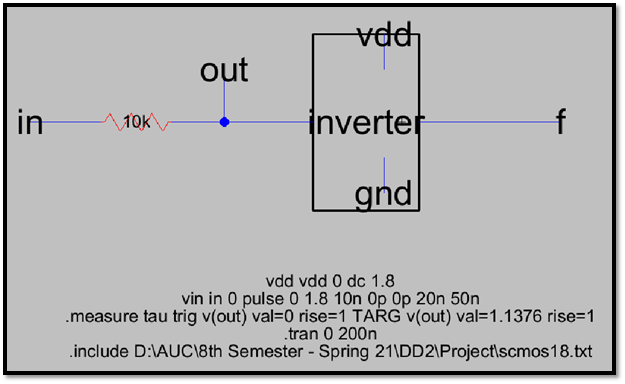
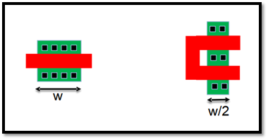
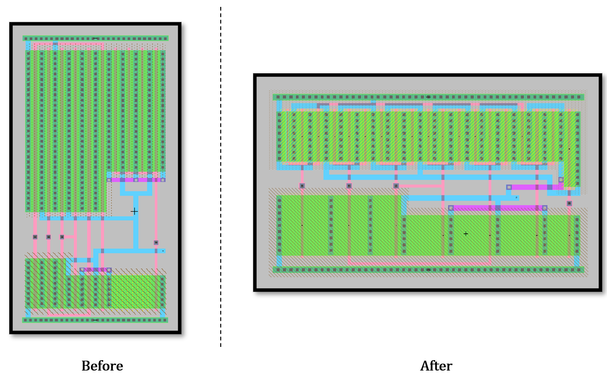

# standard-cell-library
Design (schematic and layout) and simulation of a few CMOS (1.8V) standard cells using the Electric VLSI and LTSpice software.

## Automating Sizing Optimization to Achieve Equal tpdr¬ and tpdf¬
In order to make t¬pdr¬ and t¬¬pdf as close as possible, we carry out an exhaustive testing of different combinations of PMOS and NMOS sizes, starting with the theoretical values calculated from the milestone 1. We wrote a python script (delay_equalizer.py) to automate this process. In this script, compare the ratio t¬pdr¬ / t¬¬pdf after each iteration of different PMOS-NMOS size combinations. The perfect ratio (target) for this ratio is 1.
If this ratio is greater than 1, this mean that t¬pdr¬ is greater than t¬¬pdf. This implies that the PMOS resistance is greater than that of the NMOS. So, in this case, we try to reduce the PMOS resistance by increasing the PMOS width each iteration with a fixed predetermined step of 1. Else, we do the opposite (increase the width of the NMOS) until the ratio reaches 1.

# Calculation of Cinv
We calculate Cinv for the simple inverter by connecting a 10K resistor in series with it as shown in the screenshot below:

Here, the driving circuit is the resistor, and the load circuit is the inverter. The propagation delay of the 10K resistor is the time taken for the wire 'out' to reach 63.2% of its max value. In this case, the time measured for 'out' to reach 0.632 * 1.8 = 1.1376v is 1.33044 × 1e-9 seconds. Also, we have:
tpd  = Rinv × Cinv

Cinv = tpd / Rinv = (1.33044 × 1e-9) / 10000 = 133.0440 fF

Therefore, the values obtained for Cinv, 2 Cinv, 4 Cinv and 8 Cinv are:
133.0440, 266.088, 532.176, 1064.352

# Automating Simulations
We wrote a python script (Automated Spice Simulation.py) to run 16 simulations per each cell size. As previously discussed, in each of those simulations, we try a different combination of the load (Cinv, 2 Cinv, 4 Cinv and 8 Cinv) and transition times (0ps, 100ps, 400ps and 800ps). This amounts to 16 × 19 = 304 total simulations. After each simulation we report the resulting tpdr¬ and tpdf in a separate text file.

# Height Reduction Through Multiple Fingers

In this part, we try to reduce the cell height as much as possible. Our calculations from milestone 1 show that complex function 6 of size 4 has the highest height among all other cells. So, we try to reduce the height of this cell by using multiple fingers of its transistors. The idea behind this is to reduce the transistor width by dividing it into multiple transistors, each of which share the same source, drain and gate and their equivalent connections. This is explained in the screenshot below:

The layout of function 6 of size 4 before and after applying multiple fingers:

Now, after applying multiple fingers, the newly achieved maximum height is 155. 
Following that, we have resized all other layouts to fit in a 155 height.
